# Flow Matching as a Classification Layer

This Computer Vision LAB summer project asks: **Can Flow Matching improve image classification?**

The project has three stages. Stage 1 establishes frozen-feature baselines, Stage 2 learns flows toward class prototypes, and Stage 3 places a flow before a trained linear classifier. The experiments cover DTD, FGVC-Aircraft, and Oxford Flowers-102 using ResNet-18, DINOv2 ViT-S/14, and a separate CLIP RN50 branch.

All stages and optional analyses have been executed. See the [complete results](doc/RESULTS.md) and [protocol and design notes](doc/DOC.md) for details.

## Abstract

The central question is whether Flow Matching can improve image classification. Across these experiments, the answer is qualified:

- Representation quality matters most. DINOv2 improves over ResNet-18 by 14-31 percentage points across the Stage 1 grid.
- Prototype-targeted FM is useful when the original prototype classifier is weak. Its largest Stage 2 improvement is +24.3 points on full-data Aircraft/DINOv2.
- A large raw FM gain is not automatically evidence for flow matching. On that +24.3-point setting, a direct supervised MLP already produces 97% of the gain.
- FM is most specifically useful where a direct MLP overfits and where the original classifier has a negative true-class margin.
- Transporting CLIP image embeddings toward text prototypes usually loses to the fair K-shot image-prototype control. The large improvement over zero-shot CLIP mostly measures access to labels.
- Before a frozen linear classifier, Stage 3 revision 3 improves Aircraft by about +2.1 points with either training strategy. Classifier-guided FM also improves DTD by +0.66 points, while Flowers-102 remains saturated.

## Project questions and stages

| Stage | Question | Baseline | FM component | Main deliverable |
|---|---|---|---|---|
| 1 | How strong are simple classifiers on frozen pretrained features? | Linear probe, image prototypes, zero-shot CLIP | None | A reliable comparison grid and reusable frozen artifacts |
| 2 | Can FM improve classification by transporting features toward class prototypes? | Stage 1 image-prototype rule | FM as the final learned representation-to-prototype layer | Standard FM versus rolled-out FM over the full dataset/encoder/K grid |
| 2 extension | Does the same idea work with CLIP text prototypes? | Zero-shot CLIP and a fair K-shot image-prototype control | FM in CLIP's joint image-text space | A separate controlled CLIP experiment |
| 3 | Can FM reshape features so an already-trained frozen linear classifier performs better? | Exact Stage 1 linear probe for the same subset and seed | Identity-initialized FM before the frozen head | End-to-end rollout versus classifier-guided targets |

## Shared experimental design

### Datasets

Official train, validation, and test splits are preserved throughout. Training and validation are never merged.

| Dataset | Classes | Train | Validation | Test | Role in the project |
|---|---:|---:|---:|---:|---|
| Describable Textures Dataset (DTD) | 47 | 1,880 | 1,880 | 1,880 | Mid-sized texture classification; useful for studying prompt and margin behavior |
| FGVC-Aircraft | 100 | 3,334 | 3,333 | 3,333 | Hard fine-grained recognition; the weakest baseline and largest FM gains |
| Oxford Flowers-102 | 102 | 1,020 | 1,020 | 6,149 | Near-saturated control for DINOv2; exactly ten training images per class |

### Frozen encoders and feature spaces

| Encoder | Feature dimension | Used on | Notes |
|---|---:|---|---|
| ResNet-18 / ImageNet-1K | 512 | All three datasets in Stages 1 and 2 | Frozen, evaluation mode, checkpoint-specific preprocessing |
| DINOv2 ViT-S/14 | 384 | All three datasets in Stages 1 and 2; selected for Stage 3 | Frozen, evaluation mode, standard DINOv2 preprocessing |
| CLIP RN50 | 1,024 | Stage 1 zero-shot branch and Stage 2 CLIP extension | Frozen image and text encoders with normalized joint-space embeddings |

Every encoder is put in evaluation mode, all parameters have `requires_grad=False`, and each notebook asserts that the encoder is frozen.

### Training-set sizes and repetitions

- Supervised Stage 1 and Stage 2 experiments use `K in {5, 10, full}`.
- K-shot subsets are balanced per class and use subset seeds `{0, 1, 2}`.
- Full-data trained models use initialization seeds `{0, 1, 2}`.
- Closed-form full-data prototypes are deterministic and therefore run once.
- Stage 3 uses the specification's representative operating point: DINOv2, `K=10`, `T=12`, and subset seeds `{0, 1, 2}`.
- Flowers-102 `K=10` has only one effective subset because its official training split already contains exactly ten images per class. A reported standard deviation of zero there is by construction, not evidence of exceptional stability.

### Model selection and test discipline

- Frozen features are cached once and reused across stages.
- Validation accuracy selects transforms, hyperparameters, checkpoints, and optional stopping times.
- Test data is evaluated only after selection is complete.
- Few-shot deltas are paired by subset seed: the baseline and FM model see exactly the same labeled images.
- Stage 2 verifies prototype reconstruction and subset identity for 42 dataset/encoder/K/seed combinations, with maximum drift `0.00e+00`.
- Stage 3 content-signs the loaded feature caches and linear heads and replays validation and test accuracy within `1e-6` before training FM.

## Stage 1 - frozen-feature classification baselines

Stage 1 deliberately goes beyond a minimal two-dataset or one-encoder baseline. It evaluates all three datasets with both ResNet-18 and DINOv2 at every training-set size, and it implements both prototype branches from the project specification.

### Experiment 1A - trained linear probe

The encoder is frozen and only an affine classifier `s = Wz + b` is trained with softmax cross-entropy.

For every dataset, encoder, K, and repetition, the notebook:

1. Loads the compatible cached train/validation/test features.
2. Reconstructs the balanced K-shot subset when required.
3. Evaluates six validation-only candidates covering feature transform and AdamW settings.
4. Selects the highest-validation-accuracy candidate.
5. Reloads the selected checkpoint and evaluates the complete test split once.
6. Saves the configuration, history, metrics, predictions, confusion matrix, and representative curves.

This experiment covers `3 datasets x 2 encoders x 3 training sizes x 3 repetitions`.

### Experiment 1B - image-derived class prototypes

This is a closed-form nearest-prototype classifier with no learned parameters:

1. L2-normalize every selected training feature.
2. Average normalized features within each class.
3. L2-normalize each class mean again.
4. L2-normalize validation/test features.
5. Classify by maximum cosine similarity.

The experiment uses the same datasets, encoders, K values, and subset seeds as the linear probe. Saved prototypes become the targets for the required Stage 2 experiment.

### Experiment 1C - zero-shot CLIP

The zero-shot branch uses frozen CLIP RN50 image and text encoders. One normalized text prototype is created per class using the prescribed prompt template. Classification uses maximum image-text cosine similarity and no labeled training examples.

In addition to the prescribed single prompt, an optional five-template prompt ensemble was evaluated separately. It was not selected using test labels and does not replace the required single-prompt baseline.

### Stage 1 result tables

Top-1 test accuracy. K-shot values are mean +/- sample standard deviation over subset seeds; full linear-probe values use initialization seeds; full prototypes are a single closed-form run.

#### Linear probe

| Dataset | Encoder | K=5 | K=10 | full |
|---|---|---:|---:|---:|
| DTD | ResNet-18 | .4571 +/- .0109 | .5539 +/- .0057 | .6379 +/- .0016 |
| DTD | DINOv2 | .6553 +/- .0066 | .7181 +/- .0111 | **.7764 +/- .0027** |
| Aircraft | ResNet-18 | .1927 +/- .0124 | .2621 +/- .0065 | .3654 +/- .0032 |
| Aircraft | DINOv2 | .3651 +/- .0115 | .5096 +/- .0138 | **.6752 +/- .0020** |
| Flowers-102 | ResNet-18 | .7363 +/- .0095 | .8235 +/- .0000 | .8252 +/- .0018 |
| Flowers-102 | DINOv2 | .9890 +/- .0020 | .9932 +/- .0000 | **.9937 +/- .0005** |

#### Image prototypes

| Dataset | Encoder | K=5 | K=10 | full |
|---|---|---:|---:|---:|
| DTD | ResNet-18 | .4651 +/- .0095 | .5356 +/- .0125 | .5878 |
| DTD | DINOv2 | .6366 +/- .0112 | .6936 +/- .0136 | .7297 |
| Aircraft | ResNet-18 | .1604 +/- .0081 | .1985 +/- .0046 | .2520 |
| Aircraft | DINOv2 | .2289 +/- .0083 | .2919 +/- .0053 | .3423 |
| Flowers-102 | ResNet-18 | .7019 +/- .0014 | .7522 +/- .0000 | .7522 |
| Flowers-102 | DINOv2 | .9904 +/- .0016 | .9940 +/- .0000 | .9940 |

#### Zero-shot CLIP and optional prompt ensemble

| Dataset | Prescribed prompt | Five-template ensemble | Change |
|---|---:|---:|---:|
| DTD | .3979 | .4209 | +.0230 |
| Aircraft | .1704 | .1693 | -.0011 |
| Flowers-102 | .6360 | .6559 | +.0199 |

#### Main Stage 1 plots

The three plots below summarize the complete Stage 1 comparison: supervised linear probes, supervised image prototypes, and zero-shot CLIP. Together they show both the benefit of stronger frozen features and the different way each baseline responds to additional labeled data.

**Linear probes.** DINOv2 dominates ResNet-18 on every dataset. The biggest scaling effect is on Aircraft, where the DINOv2 probe continues improving through the full-data setting instead of plateauing early.

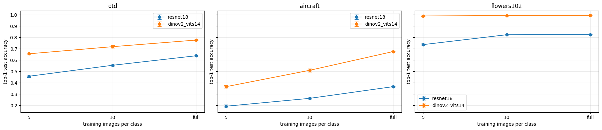

**Image prototypes.** Prototypes remain competitive with very few examples, especially on DTD and Flowers, but their class-mean decision rule stops scaling well on fine-grained Aircraft recognition.

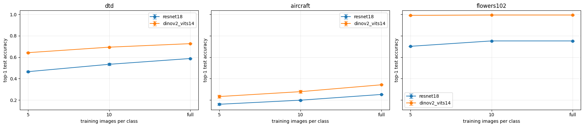

**Zero-shot CLIP.** The prompt ensemble improves DTD and Flowers but not Aircraft, so prompt diversity is useful only when the class names and visual concepts transfer cleanly to the text encoder.

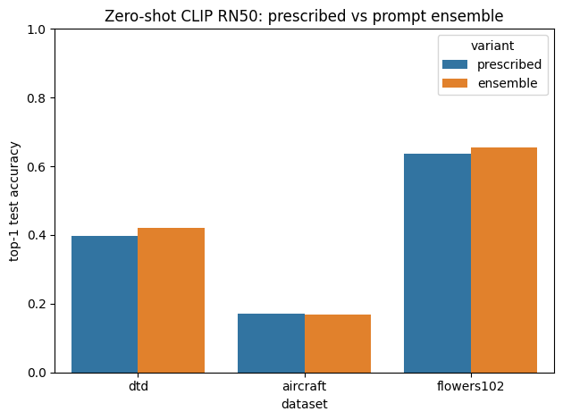

#### Stage 1 feature geometry - all datasets

The image-prototype panel covers DTD, Aircraft, and Flowers-102 with both ResNet-18 and DINOv2. Every row uses the same test examples in its PCA and t-SNE views, and the `X` markers are the matching class prototypes. DINOv2 produces much cleaner clusters on DTD and Flowers, while Aircraft retains substantial class overlap even with the stronger encoder; this visually matches the accuracy gap in the tables above.

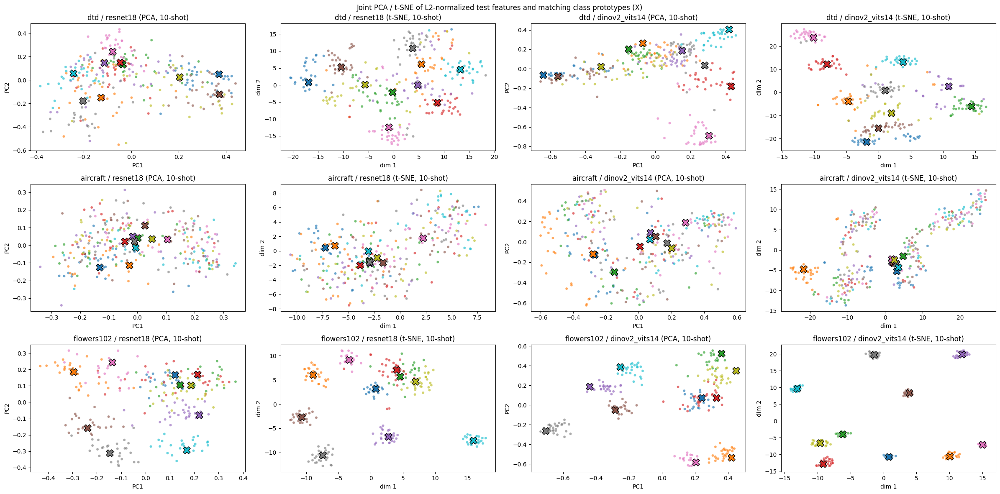

The CLIP panel covers all three datasets in the joint image/text space. The image points and text-prototype `X` markers reveal a pronounced modality gap, especially for DTD and Aircraft, which motivates the Stage 2 CLIP transport experiment.

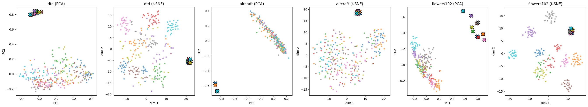

### Stage 1 figures and analyses produced

- Accuracy versus training-set size for every dataset/encoder combination, with error bars where repetitions exist.
- Representative train/validation loss curves for each dataset/encoder pair.
- Row-normalized confusion matrices for representative settings on all three datasets.
- Joint PCA and t-SNE views of test features and image prototypes.
- Joint CLIP image/text visualizations showing the modality gap between image embeddings and text prototypes.
- Example zero-shot predictions and failure galleries.

### Stage 1 findings

- DINOv2 is consistently stronger than ResNet-18; the encoder gap is larger than any baseline-method gap in the project.
- The linear probe is the strongest full-data method except for the already saturated Flowers/DINOv2 setting.
- Image prototypes are competitive in the lowest-data regime and even beat the DTD/ResNet-18 linear probe at K=5, but they stop scaling because a class mean discards within-class structure.
- Aircraft is the hardest dataset. Its DINOv2 linear probe rises from .3651 at K=5 to .6752 at full data, while the DINOv2 prototype rule stalls at .3423.
- Zero-shot CLIP is surprisingly competitive on Aircraft: .1704 beats the K=5 ResNet-18 prototype baseline at .1604. Text prompts are less effective for DTD and Flowers than supervised DINOv2 features.
- Prompt ensembling helps textures and flowers but does not help aircraft variant names.

### Stage 1 extended scope completed

| Addition beyond the minimum baseline | Status | Purpose |
|---|---|---|
| All three datasets instead of a smaller subset | Completed | Keep every later stage comparable and retain Flowers as a saturation control |
| Both ResNet-18 and DINOv2 on every dataset | Completed | Measure representation quality rather than confounding it with dataset choice |
| Both image-prototype and zero-shot CLIP branches | Completed | Preserve both possible Stage 2 directions |
| Five-template CLIP prompt ensemble | Completed | Measure prompt sensitivity without replacing the prescribed prompt |
| Confusion matrices and joint feature/prototype embeddings | Completed | Add qualitative evidence about error structure and geometry |

## Stage 2 - Flow Matching toward class prototypes

The required Stage 2 branch builds on the image-derived prototypes from Stage 1. It never re-runs an encoder and never recomputes a prototype from a different subset.

### Required experimental grid

| Axis | Values |
|---|---|
| Datasets | DTD, FGVC-Aircraft, Flowers-102 |
| Encoders | ResNet-18, DINOv2 ViT-S/14 |
| Training sizes | K=5, K=10, full |
| Objectives | Standard FM, rolled-out FM |
| Euler steps | T=4 and T=12 |
| Repetitions | Three per dataset/encoder/K setting |

The velocity network is shared across Stage 2 variants: `(d+1) -> 512 -> 512 -> d`, with SiLU activations and scalar time concatenated to the feature.

### Experiment 2A - standard Flow Matching

For a frozen source feature `z`, label prototype `p_y`, and random `t ~ Uniform(0,1)`:

```text
z_t = (1 - t) z + t p_y
target velocity = p_y - z
loss = ||v_theta(z_t, t) - (p_y - z)||^2
```

One standard-FM network is trained per dataset/encoder/K/repetition and then evaluated with both `T=4` and `T=12`. Because the training objective does not depend on the inference step count, separate standard networks per T would be redundant.

### Experiment 2B - rolled-out endpoint training

The model runs the same T-step Euler sequence used at inference and minimizes the endpoint error:

```text
z_hat_(k+1) = z_hat_k + (1/T) v_theta(z_hat_k, k/T)
loss = ||z_hat_T - p_y||^2
```

The complete rollout remains differentiable. Separate networks are trained for `T=4` and `T=12` because T is part of this training objective.

### Training and result counts

- 54 standard-FM networks: 18 dataset/encoder/K settings x 3 repetitions.
- 108 rolled-out networks: the same settings and repetitions x 2 values of T.
- 162 trained networks in the required image-prototype branch.
- 216 result rows because each standard network is reported at both T values.

### Required Stage 2 results

Each cell is the best of standard/rolled-out training and `T in {4,12}`. Parentheses show `Delta Acc` against the matching Stage 1 image-prototype baseline.

| Dataset | Encoder | K=5 | K=10 | full |
|---|---|---:|---:|---:|
| DTD | ResNet-18 | .4704 (+.0053) | .5410 (+.0053) | .5931 (+.0053) |
| DTD | DINOv2 | .6416 (+.0051) | .7027 (+.0091) | .7397 (+.0100) |
| Aircraft | ResNet-18 | .1985 (+.0381) | .2514 (+.0529) | .3180 (+.0660) |
| Aircraft | DINOv2 | .3399 (+.1110) | .4257 (+.1338) | **.5852 (+.2428)** |
| Flowers-102 | ResNet-18 | .7170 (+.0151) | .7852 (+.0330) | .7859 (+.0337) |
| Flowers-102 | DINOv2 | .9917 (+.0013) | .9941 (+.0002) | .9944 (+.0004) |

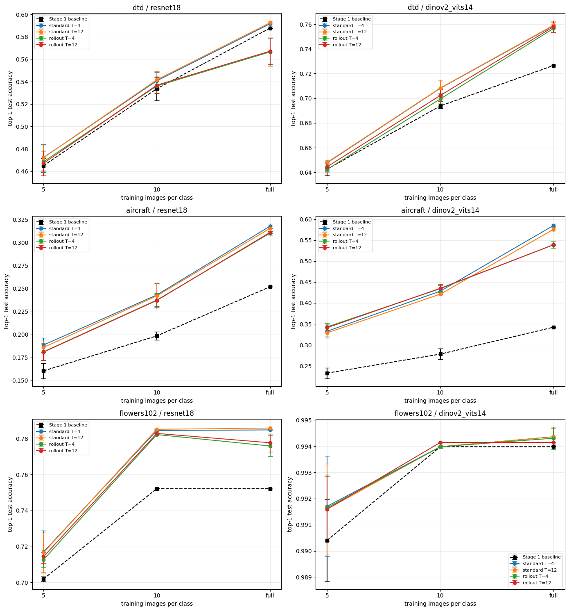

### Required Stage 2 figures produced

- Five-series accuracy-versus-K plots: prototype baseline, standard T=4/T=12, and rolled-out T=4/T=12.
- Representative training-loss curves for both objectives across all six dataset/encoder combinations.
- Joint PCA and joint t-SNE comparisons of original features, standard-FM features, rolled-out-FM features, and prototypes.
- Step-by-step PCA trajectories from source features to transported endpoints.

### Stage 2 findings

- FM has a positive mean delta in 66/72 result cells, is flat in three, and regresses in three.
- All three mean regressions come from rolled-out training and none is significant at the run level.
- Standard FM is at least as accurate as rolled-out training in 14/18 dataset/encoder/K settings and is cheaper because it does not backpropagate through T sequential evaluations.
- The gain grows with K and is largest where the prototype baseline is weakest. Aircraft/DINOv2 grows from +.1110 at K=5 to +.2428 at full data.
- FM closes a median 59% of the prototype-to-linear-probe gap over the 14 settings where that gap is positive. It is an improvement over prototypes, not a replacement for the discriminatively trained linear probe.
- Both objectives train stably: none of 162 runs diverged, 161 early-stopped, and one reached the epoch cap.
- Two Euler evaluations already recover the median T=12 gain. One evaluation recovers about 62% and is negative in three settings.

### Main Stage 2 diagnostic plots

**Accuracy through flow time.** Several representative trajectories peak before the endpoint or fluctuate as the rollout progresses. This is why intermediate-time evaluation and validation-selected stopping were included.

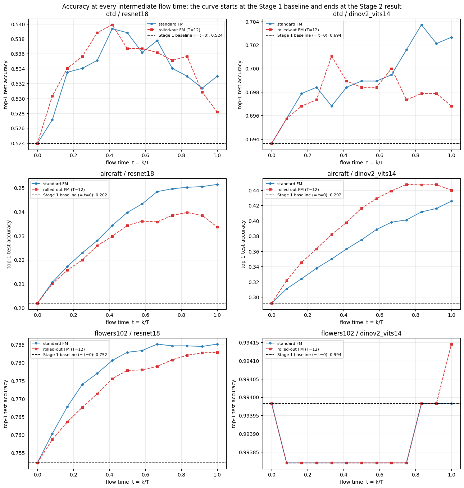

**Inference-step ablation.** Two Euler evaluations recover the median full gain of the standard FM models; using more steps is not automatically more accurate.

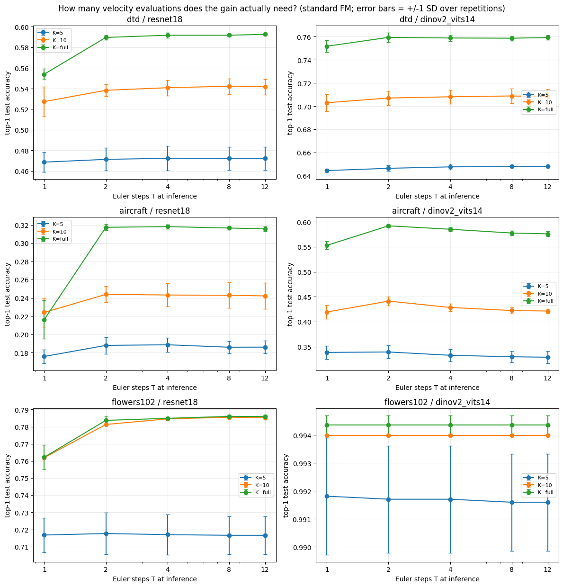

**FM in linear-probe context.** The flow substantially closes the prototype-to-probe gap in difficult settings, especially Aircraft, but generally remains below the discriminatively trained linear classifier.

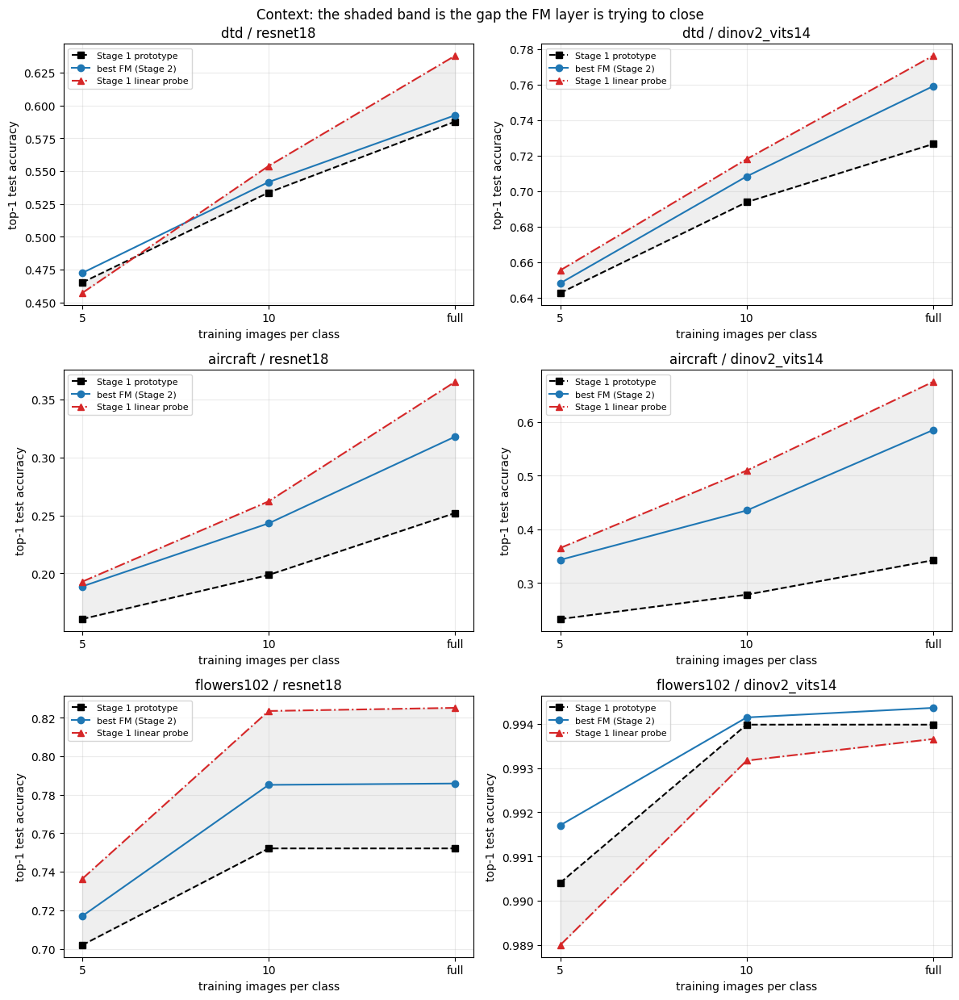

### Stage 2 t-SNE geometry - all datasets

Each dataset/encoder row below uses one joint t-SNE coordinate system for the original features, standard FM endpoints, rolled-out FM endpoints, and class prototypes. The largest visible reorganization occurs on Aircraft/DINOv2, the same setting with the largest accuracy gain. Flowers/DINOv2 is already separated before transport, consistent with its near-zero improvement.

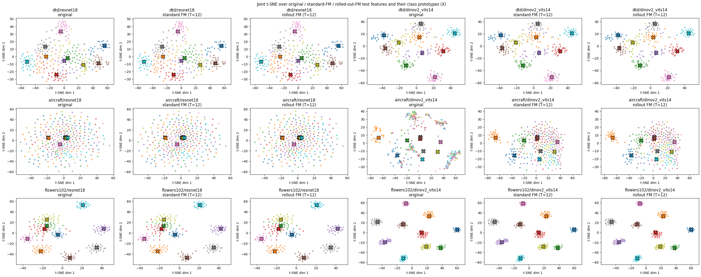

The executed Aircraft/DINOv2 example below plays the twelve Euler updates for one test image. It compares standard FM with rolled-out FM while retaining the background cloud and prototype locations in a fixed projection.

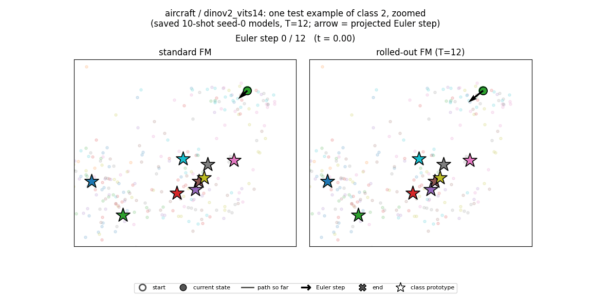

### Statistical hardening and control experiments

These analyses were added after the required grid and were all executed.

#### Paired run-level confidence intervals

Because Stage 2 reuses the exact Stage 1 subsets, the correct comparison is the within-seed delta rather than a difference between two independently averaged means.

| Paired Stage 2 outcome | Cells |
|---|---:|
| Positive mean delta | 66 / 72 |
| 95% interval excludes zero | 48 / 72 |
| Degenerate Flowers-102 K=10 intervals | 8 |
| Non-degenerate effects distinguishable from zero | **40 / 72** |

All 24 Aircraft cells exclude zero, compared with 7/24 DTD cells and 17/24 Flowers cells. Most sub-one-point DTD gains are therefore reported as no measurable effect.

#### Direct-MLP and time-free residual controls

Two controls use the same hidden architecture, optimizer, schedule, subsets, and seeds:

- `direct`: one supervised MLP maps `z` directly toward `p_y`, with no time input and no integration.
- `residual`: the same shared network is applied repeatedly, but without time conditioning or per-time velocity supervision.

FM beats both controls in 16/18 settings. However, on full-data Aircraft/DINOv2, the prototype baseline is .3423, the direct MLP reaches .5783, and FM reaches .5852. The direct MLP therefore explains 97% of the headline gain. FM's specific advantage is clearest on DTD/ResNet-18 and Flowers/ResNet-18, where the direct MLP overfits below the baseline while FM remains above it.

### Optional Stage 2 experiments completed

| Optional or diagnostic experiment | What was measured | Main outcome |
|---|---|---|
| Intermediate flow times | Accuracy, true-prototype cosine, margin, and displacement at every Euler state | Cosine rises everywhere, but classification margin improves mainly on Aircraft where the baseline was mis-ranked |
| Point-cloud snapshots | Joint PCA views at `t in {0,.25,.5,.75,1}` | Makes contraction toward prototypes visible without changing coordinate systems |
| Validation-selected stopping time `t*` | Select t on validation, evaluate it once on test | Helps 18/36 conditions, mean +.0018, best +.0303; converts the largest regression into a gain |
| Reverse flow | Backward integration from prototypes with recovery and distance metrics | Image prototypes barely move; the learned forward transport behaves like a contraction, not an invertible map |
| Geometry through time | Within-class scatter W, between-class separation B, W/B, and competitor similarity | W/B falls in all 12 measured curves; the flow discriminates rather than only contracts |
| Inference-step ablation | Standard FM with T in {1,2,4,8,12} | T=2 delivers the median full gain; T=1 is insufficient in some settings |
| Prediction transitions | Fixed, broken, unchanged, and pre-flow margin | Every fixed sample group starts with negative margin; every broken group starts with positive margin |
| Stage 1 linear-probe context | Prototype, FM, and probe in one table | FM recovers part of the gap but generally does not surpass the probe |
| Animated trajectories | Standard and rolled-out paths from the same source | Shows the actual Euler updates; used qualitatively because the display is a 2-D projection |

## Stage 2 CLIP extension - flow toward text prototypes

The CLIP extension transports frozen CLIP RN50 image embeddings toward normalized text prototypes. It uses the same FM architecture and training protocol as the image branch, but it is a separate scientific question because the target comes from another modality.

The FM model is supervised by labeled image/text-prototype pairs, so it is no longer zero-shot. Every result must therefore be shown against two references:

1. Zero-shot CLIP, which measures how much labeled training changes the result.
2. A K-shot image-prototype classifier built from the same CLIP image features and identical labeled subsets, which isolates whether FM uses those labels better.

The branch trains 81 velocity networks and produces 108 result rows.

Best variant per dataset/K, shown as `accuracy (delta vs zero-shot / delta vs K-shot control)`:

| Dataset | K=5 | K=10 | full |
|---|---:|---:|---:|
| DTD | .3679 (-.0300 / -.1395) | .5922 (+.1943 / +.0211) | .6454 (+.2475 / +.0348) |
| Aircraft | .1950 (+.0246 / -.0396) | .2330 (+.0626 / -.0417) | .2822 (+.1118 / -.0442) |
| Flowers-102 | .7414 (+.1054 / -.0896) | .8216 (+.1856 / -.0608) | .8155 (+.1794 / -.0669) |

| Dataset | Zero-shot | Control K=5 | Control K=10 | Control full |
|---|---:|---:|---:|---:|
| DTD | .3979 | .5074 | .5711 | .6106 |
| Aircraft | .1704 | .2346 | .2747 | .3264 |
| Flowers-102 | .6360 | .8310 | .8824 | .8824 |

The CLIP plot makes the control comparison explicit: FM often improves over the zero-shot reference because it receives labels, but the same-supervision image-prototype control is usually stronger. DTD is the exception at K=10 and full data.

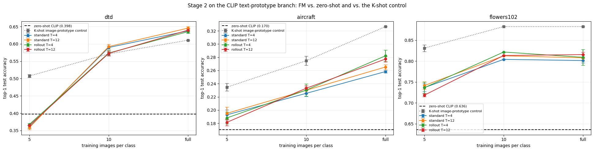

The corresponding joint t-SNE views cover DTD, Aircraft, and Flowers-102. They show the image cloud moving toward the text prototypes, but visual alignment alone does not establish a classification advantage: the accuracy table above still shows that the same-supervision image-prototype control usually wins.

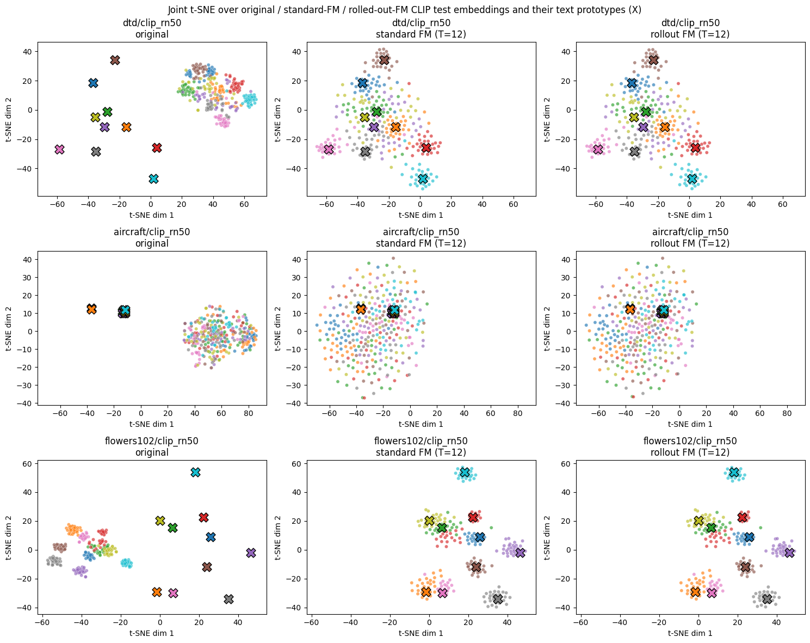

### CLIP extension findings

- FM beats zero-shot in 32/36 cells because it has access to labels.
- Raw means beat the same-supervision control in only 8/36 cells.
- Paired intervals support 6 FM wins, 28 control wins, and 2 no-effect cells.
- At DTD K=5, FM is worse than zero-shot itself.
- Validation-selected `t*` helps 17/18 conditions, with mean +.0239 and best +.0520, but never converts a loss against the K-shot control into a win.
- Reverse flow provides quantitative evidence of the CLIP modality gap. Text-prototype recovery rises from .55/.25/.75 to 1.00/.75/1.00 for DTD/Aircraft/Flowers, and the reverse-flowed prototypes land close to their matching image centroids.
- Joint PCA/t-SNE, intermediate-time snapshots, reverse-flow strips, trajectories, and animations were produced for this branch as well.

### Stage 2 experiments implemented but not executed

These are not part of the reported results:

| Gated experiment | Status | Why it remains separate |
|---|---|---|
| Zero-output initialization pilot for Stage 2 | Implemented, not run | Would require about 72 additional networks and would replace all headline values only if adopted |
| Extended repetitions with seeds 0-9 | Implemented, not run | Supplemental power analysis; the required protocol remains three repetitions |
| Per-T checkpoint-selection columns | Code implemented; existing standard runs were loaded rather than retrained | `test_accuracy_sel_T` requires one `FORCE_RETRAIN_STANDARD=True` pass; headline `test_accuracy` is unaffected |

## Stage 3 - Flow Matching before a frozen linear classifier

Stage 3 changes the role of FM. Instead of transporting toward a class prototype and classifying by cosine similarity, the flow transforms features before the exact frozen Stage 1 linear head:

```text
frozen encoder feature z
        -> FM rollout F_theta(z)
        -> transported feature z_hat
        -> frozen classifier W z_hat + b
        -> logits
```

### Required Stage 3 grid

| Axis | Choice |
|---|---|
| Datasets | DTD, FGVC-Aircraft, Flowers-102 |
| Encoder | DINOv2 ViT-S/14 |
| Training size | K=10 |
| Euler steps | T=12 for training and inference |
| Subset seeds | 0, 1, 2 |
| FM strategies | End-to-end rolled-out classification; classifier-guided targets |

This produces 18 trained FM layers and 27 main-grid rows: 9 exact loaded linear-probe baselines plus 9 end-to-end and 9 guided results.

### Identity initialization and safety guards

The output layer of the velocity network is zeroed, making the initial field exactly zero and the untrained Euler rollout exactly the identity. Stage 3 verifies:

- The reloaded Stage 1 head reproduces saved validation and test accuracy within `1e-6`.
- The untrained FM returns `rollout(z) == z` bit for bit.
- The untrained system's predictions equal the linear probe's predictions.
- The frozen classifier receives no gradients.
- End-to-end loss backpropagates through every Euler step into FM.
- Guided targets stay source-bounded, do not increase classifier loss, and produce an active standard-FM gradient.

Epoch 0 is an eligible checkpoint. This makes the selection rule "keep FM only if it improves validation accuracy." Consequently, validation delta is non-negative by construction; only test delta is evidence of improvement.

### Experiment 3A - end-to-end rolled-out classification

The complete T-step rollout is passed through the frozen classifier. Cross-entropy is backpropagated through all Euler steps, and only FM parameters are updated.

Revision 3 adds a scale-free relative displacement penalty with `lambda_disp=1` to the main comparison. The unregularized model remains an explicit control.

### Experiment 3B - classifier-guided targets

The current FM endpoint is passed through the frozen classifier. Gradients with respect to the endpoint feature, not the model parameters, construct a nearby lower-loss target. Standard conditional FM is then trained between the original source feature and that target.

Revision 3 separates four choices that earlier implementations conflated:

- Per-sample trust-region radius relative to `||z||`.
- Step length as a fraction of that radius.
- Gradient normalization.
- Projection into a source-centered trust region.

Targets are refreshed as FM changes, and the lowest-cross-entropy feasible candidate is retained.

### Required Stage 3 results - revision 3

Top-1 test accuracy, mean +/- sample standard deviation over the paired subset seeds.

| Dataset | Frozen linear probe | End-to-end, lambda-disp=1 | Delta | Classifier-guided | Delta |
|---|---:|---:|---:|---:|---:|
| DTD | .7167 +/- .0081 | .7144 +/- .0042 | -.0023 | **.7232 +/- .0070** | **+.0066** |
| Aircraft | .5285 +/- .0064 | .5496 +/- .0059 | **+.0211** | **.5497 +/- .0059** | **+.0212** |
| Flowers-102 | .9935 +/- .0000 | .9935 +/- .0000 | +.0000 | .9935 +/- .0000 | +.0000 |

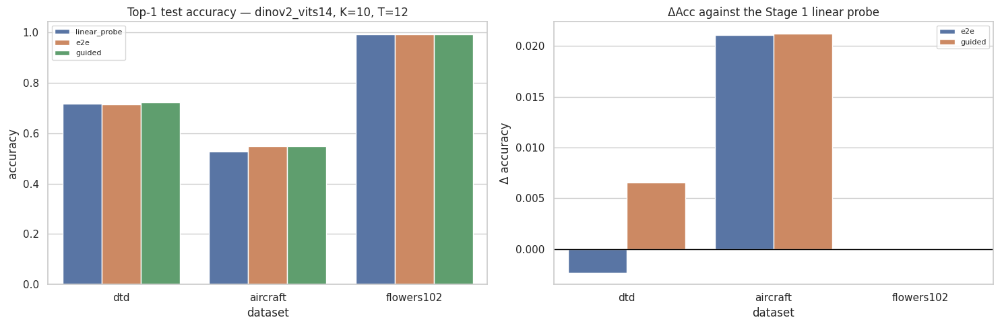

### Stage 3 paired evidence

- Nine of 18 method/seed cells favor Stage 3, one favors the probe, and eight tie exactly.
- Eight bootstrap intervals exclude zero; the same eight cells have significant exact McNemar tests.
- Every Aircraft seed improves under both strategies.
- Guided FM improves every DTD seed; five of its six positive DTD/Aircraft cells are significant.
- The one negative cell is DTD end-to-end seed 1. Its interval includes zero.
- Eight selected checkpoints remain at epoch 0: two DTD end-to-end runs and all six Flowers runs.

The effect-size view exposes the paired result behind the averages: Aircraft improves consistently under both methods, guided FM produces the reliable DTD gain, and Flowers remains exactly at identity.

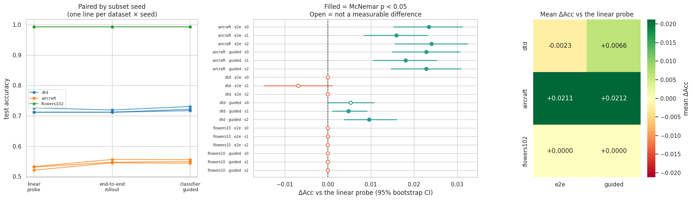

### Stage 3 t-SNE geometry - all datasets

The joint t-SNE panel compares the original representation, displacement-regularized end-to-end FM, and classifier-guided FM for the same examples and shared axes. Aircraft shows the clearest nonlinear rearrangement and the largest accuracy gain; DTD changes more subtly; Flowers-102 is visually unchanged because the identity checkpoint was selected.

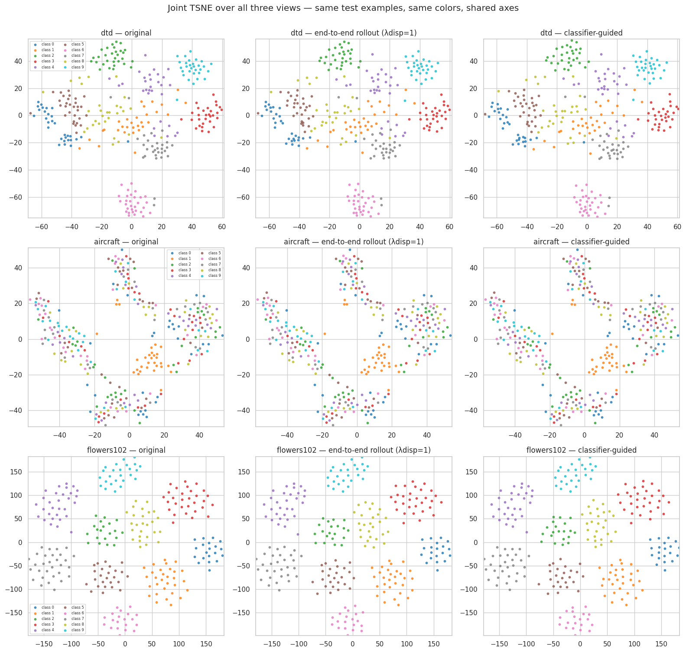

#### Aircraft population rollout - Section 23

The population animation plays the complete Euler rollout for both Stage 3 strategies in a single fixed projection. Frame labels report the exact test accuracy at each Euler state; interpolation is used only to smooth playback.

[Play or download `flow_population_aircraft.mp4`](doc/media/flow_population_aircraft.mp4)

### Required Stage 3 figures produced

- Accuracy and paired-delta bars for the probe and both FM strategies.
- Representative training loss, validation loss, and validation accuracy curves.
- Joint PCA and joint t-SNE views of original, end-to-end, and guided feature spaces with shared axes.
- Paired bootstrap and McNemar tables.

### Stage 3 variant experiments completed

#### End-to-end regularization sweep

Seed 0 compares:

- No regularization.
- Relative displacement penalties `lambda in {1, 10, 100}`.
- Relative velocity penalty `lambda=1e-3`.

On Aircraft, `lambda=1` raises accuracy from .5530 to .5563 while reducing relative displacement from .727 to .058. On DTD, `lambda=10` produces the best seed-0 result, .7176 (+.0059). Flowers remains at identity for every setting.

The sweep shows why `lambda_disp=1` became the main end-to-end configuration: it preserves the Aircraft accuracy gain while reducing unnecessary feature movement by more than an order of magnitude.

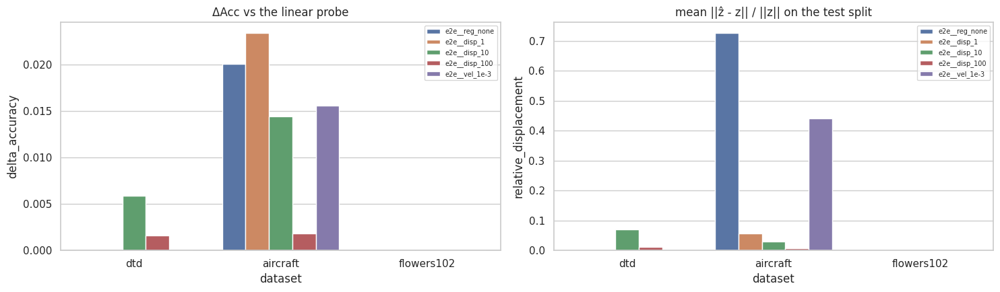

#### Classifier-guidance sweep

The sweep varies trust-region radius, within-radius step fraction, number of target steps, raw versus unit-normalized gradients, projection on/off, refresh frequency, source versus current anchoring, and monotone target acceptance.

On Aircraft seed 0, radius .20 reaches .5650 (+.0321), ten target steps reach .5620 (+.0291), and removing the constraint reaches .5617 (+.0288), compared with .5557 (+.0228) for the fixed main configuration. These are single-seed ablations and do not replace the required table.

Several guidance variants add more Aircraft accuracy than the fixed main setting, but they are reported as single-seed sensitivity experiments rather than promoted to the paired headline result.

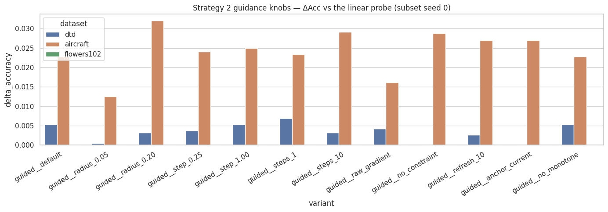

### Optional Stage 3 joint fine-tuning completed

After the required frozen-head comparison, a copy of the classifier is unfrozen and trained jointly with FM. The experiment includes the control required for interpretation: continue training the head for the same budget with no FM.

Each joint model is evaluated four ways:

- `probe = W0 z + b0`
- `fm_only = W0 z_hat + b0`
- `head_only = W1 z + b1`
- `full = W1 z_hat + b1`

| Dataset / strategy | Probe | FM only | Head only | Full joint | Interpretation |
|---|---:|---:|---:|---:|---|
| Aircraft / end-to-end | .5285 | .5445 | .5344 | .5502 | FM performs most of the work |
| Aircraft / guided | .5285 | .5491 | .5281 | .5520 | FM performs most of the work |
| DTD / end-to-end | .7167 | .7145 | .7167 | .7144 | No joint gain; FM causes the regression |
| DTD / guided | .7167 | .7211 | .7168 | .7213 | FM performs most of the work |
| Flowers-102 / either | .9935 | .9935 | .9935 | .9935 | No remaining headroom |

The joint extension also sweeps classifier learning-rate ratios, delayed unfreezing at epochs 10 and 30, and anchor penalties on drift from the original Stage 1 head. Classifier weight/bias drift and per-class weight cosine are recorded.

The four-way evaluation separates feature transport from classifier retraining. Most of the useful Aircraft and DTD-guided improvement is already present in the `FM only` leg; updating the head adds only a smaller increment.

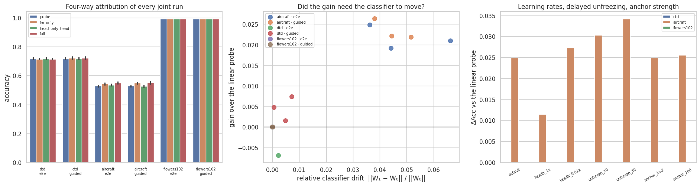

### Optional Stage 3 analyses completed

| Analysis | Purpose | Main result |
|---|---|---|
| Accuracy, CE, margin, and displacement through flow time | Show when the classifier changes and verify both endpoints | `t=0` exactly matches the probe and `t=1` exactly matches the reported Stage 3 result |
| Validation-selected `t*` | Test whether the endpoint overshoots | Improves 0/6 aggregate conditions in revision 3; mean change -.0002 |
| Intermediate point-cloud snapshots | Visualize how the representation changes | Joint PCA at five flow times with shared samples, colors, and axes |
| Reverse flow from classifier templates and class means | Probe reversibility without explicit Stage 3 prototypes | Aircraft template recovery falls from .61 to .53/.49, while round-trip recovery remains 1.0 |
| Fixed/broken prediction analysis | Distinguish precise fixes from churn | Aircraft averages about 124-126 fixed and 53-55 broken predictions per strategy |
| Translation-versus-transport decomposition | Test whether FM acts like one global bias shift | Sample-dependent residual transport explains about 97-99% of the Aircraft seed-0 gain |
| Per-class effects | Identify uneven gains and regressions | Aircraft improves many classes but still hurts a non-trivial minority |
| Representative trajectories | Show paths selected by fixed/broken/unchanged outcomes | Demonstrates that the same field can fix and break examples |
| Effect-size panel | Put paired changes and intervals in one view | Makes identity, improvement, and the DTD regression directly comparable |
| Population and individual-path videos | Show the actual T-step rollout | Complete test accuracy is displayed at each Euler state; interpolation is presentation only |
| Concentric-rings simulation | Draw the frozen decision boundary and velocity field directly in 2-D | Probe .4583; unregularized end-to-end FM .9740; guided variants keep identity |
| Inline artifact report | Reload every saved table, figure, and animation | Ensures cached reruns still display the complete result set |

The displacement decomposition rules out a trivial global-shift explanation for the main Aircraft gain. Roughly 97-99% of the improvement comes from sample-dependent residual transport.

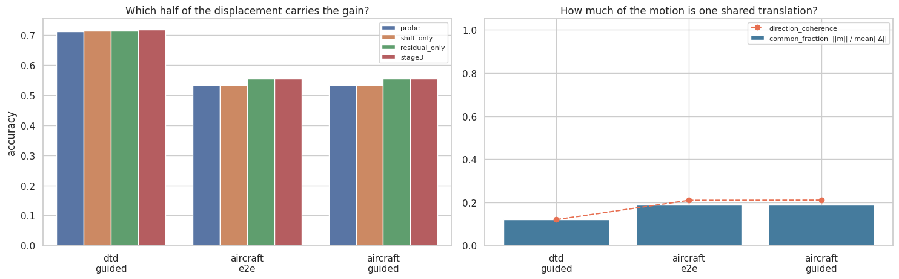

### Stage 3 findings

- Both strategies add about 2.1 points on Aircraft and improve every paired subset.
- Classifier-guided FM adds .66 points on DTD. The displacement-regularized end-to-end model averages a small -.23-point regression there.
- Flowers-102 is a useful negative control: all six FM runs retain the exact identity because the DINOv2 probe already scores .9935.
- On Aircraft, common translation explains only 1-3% of the seed-0 gain; the improvement comes from sample-specific nonlinear transport.
- Joint fine-tuning does not explain away the result. The FM-only leg retains most of the useful Aircraft and DTD-guided gains.
- The guided trust region binds for the default configuration, so its radius is a substantive modeling assumption rather than an inactive safeguard.
- Freezing the classifier does not make the complete model linear. The nonlinear FM can warp feature space before the fixed affine boundary, as the rings simulation demonstrates.

## Cross-stage conclusions

1. **Choose the representation first.** Moving from ResNet-18 to DINOv2 has a larger effect than changing the downstream classifier in almost every setting.
2. **FM is most useful when the original decision rule is structurally weak.** Aircraft's negative prototype margin predicts the largest Stage 2 gains, and its weak K=10 probe leaves room for Stage 3 gains.
3. **Always use a fair control.** The CLIP extension looks strong against zero-shot and weak against the same-supervision prototype control. The largest Stage 2 image-branch gain is mostly reproduced by a direct MLP.
4. **Flow-specific value is robustness and iterative structure, not merely capacity.** FM is clearest where the direct MLP overfits, and the time-free residual control sits closer to FM than the one-shot direct MLP.
5. **More Euler steps are not automatically better.** Two steps are enough for the median standard-FM gain, and validation-selected early stopping is useful only in overshooting cases.
6. **Identity checkpointing makes null results interpretable.** In Stage 3, a selected epoch-0 model is explicitly counted as "FM learned nothing useful" rather than hidden inside an average.


## Repository structure

| Path | Purpose |
|---|---|
| `01_linear_probe.ipynb` | Stage 1 frozen-feature linear probes and feature caches |
| `02_image_prototypes.ipynb` | Stage 1 image-derived prototype classifiers |
| `03_zero_shot_clip.ipynb` | Stage 1 zero-shot CLIP and prompt ensemble |
| `04_flow_matching.ipynb` | Required Stage 2 image-prototype FM branch and its controls/diagnostics |
| `05_flow_matching_clip.ipynb` | Stage 2 CLIP extension with same-supervision controls |
| `06_fm_before_classifier.ipynb` | Stage 3 frozen-classifier comparison, variants, and optional analyses |
| `stage1_config.json` | Shared experiment plan and per-stage configuration |
| `doc/RESULTS.md` | Full numerical result and interpretation record |
| `doc/DOC.md` | Protocol, design decisions, and failure modes |
| `doc/STAGE2_COMPLIANCE.md` | Stage 2 specification-to-implementation map |
| `doc/STAGE3_COMPLIANCE.md` | Stage 3 specification-to-implementation map |
| `doc/TODO_stage*.md` | Verified task state; unchecked items are genuinely open |
| `tests/test_stage3_notebook.py` | Lightweight Stage 3 source and synthetic-behavior checks |

## Reproducing the project

The notebooks are designed for Google Colab and persist expensive artifacts under `/content/drive/MyDrive/Flow-Matching`. The plan lives in `stage1_config.json`; notebooks also carry a matching fallback configuration for sessions where the JSON has not yet been copied to Drive.

Run in order:

1. `01_linear_probe.ipynb`
2. `02_image_prototypes.ipynb`
3. `03_zero_shot_clip.ipynb`
4. `04_flow_matching.ipynb`
5. `05_flow_matching_clip.ipynb`
6. `06_fm_before_classifier.ipynb`

Every expensive stage uses compatibility-checked cache/reuse behavior. Force-retrain flags should be enabled only for an intentional clean retraining pass because changed implementations, hyperparameters, or upstream artifact signatures invalidate downstream comparisons.

To rebuild the consolidated PDF and the three README figures after notebook results change:

```powershell
python doc/build_report.py
```

For the detailed evidence behind every summary statement, see [doc/RESULTS.md](doc/RESULTS.md). For protocol choices such as normalization order, seed roles, checkpoint selection, and cache compatibility, see [doc/DOC.md](doc/DOC.md).
